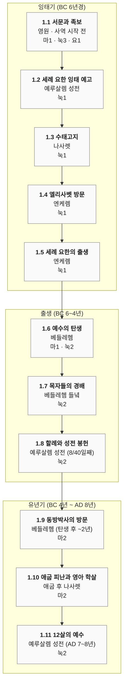

# 예수의 생애 — Mermaid 타임라인

[[life-of-jesus|메인 타임라인]]의 시각화 버전. 다이어그램에서 사건의 흐름을 한눈에 보고, 아래 **본문 링크** 목록에서 각 복음서 시작 절로 점프합니다. (Mermaid 다이어그램 자체는 클릭 가능한 링크를 지원하지 않아 별도 목록으로 둡니다.)

---

## 1부 · 탄생과 유년기 (BC 6 ~ AD 8)

### 본문 링크

- **[[life-of-jesus#1.1 서문과 족보|1.1 서문과 족보]]** — [[마1#1|마 1:1-17]] · [[눅3#23|눅 3:23-38]] · [[요1#1|요 1:1-18]]
- **[[life-of-jesus#1.2 세례 요한의 잉태 예고|1.2 세례 요한 잉태 예고]]** — [[눅1#5|눅 1:5-25]]
- **[[life-of-jesus#1.3 수태고지 (마리아에게)|1.3 수태고지]]** — [[눅1#26|눅 1:26-38]]
- **[[life-of-jesus#1.4 마리아의 엘리사벳 방문|1.4 엘리사벳 방문]]** — [[눅1#39|눅 1:39-56]]
- **[[life-of-jesus#1.5 세례 요한의 출생|1.5 세례 요한의 출생]]** — [[눅1#57|눅 1:57-80]]
- **[[life-of-jesus#1.6 예수의 탄생|1.6 예수의 탄생]]** — [[마1#18|마 1:18-25]] · [[눅2#1|눅 2:1-7]]
- **[[life-of-jesus#1.7 목자들의 경배|1.7 목자들의 경배]]** — [[눅2#8|눅 2:8-20]]
- **[[life-of-jesus#1.8 할례와 성전 봉헌|1.8 할례와 성전 봉헌]]** — [[눅2#21|눅 2:21-38]]
- **[[life-of-jesus#1.9 동방박사의 방문|1.9 동방박사의 방문]]** — [[마2#1|마 2:1-12]]
- **[[life-of-jesus#1.10 애굽 피난과 영아 학살|1.10 애굽 피난·영아 학살]]** — [[마2#13|마 2:13-23]]
- **[[life-of-jesus#1.11 12살의 예수, 성전에서|1.11 12살의 예수]]** — [[눅2#41|눅 2:41-52]]

---

> [!warning] 미리보기 (Part 1만)
> 2~9부는 형식 확인 후 추가합니다. 현재 보이는 디자인 결정:
> - **대분류** = `## 1부 · 탄생과 유년기` 제목 (Markdown)
> - **중분류 (소절)** = Mermaid `subgraph` (잉태기 / 출생 / 유년기) — 1부 안의 시간 단계, 박스로 감싸 보여줌
> - **사건** = `flowchart TD` 노드, 화살표로 시간 순서. 박스 안에 **제목 · 장소(시점) · 복음서 장 요약** 3줄
> - **본문 정밀 ref와 링크** = 다이어그램 밖 목록으로 분리 (Mermaid 노드는 클릭 불가)
>
> Mermaid `timeline` 차트는 수직 방향을 지원하지 않고 글자도 작아서 `flowchart TD`로 갈아탔습니다. 콜론(`:`)·하이픈은 timeline 차트의 구분자였지만 flowchart에서는 일반 텍스트라 자유롭게 쓸 수 있습니다 (그래도 본문 절 범위는 다이어그램 밖 링크 목록에 두어 박스를 깔끔하게 유지).

← [[index|메인]] · [[life-of-jesus|상세 타임라인]]
